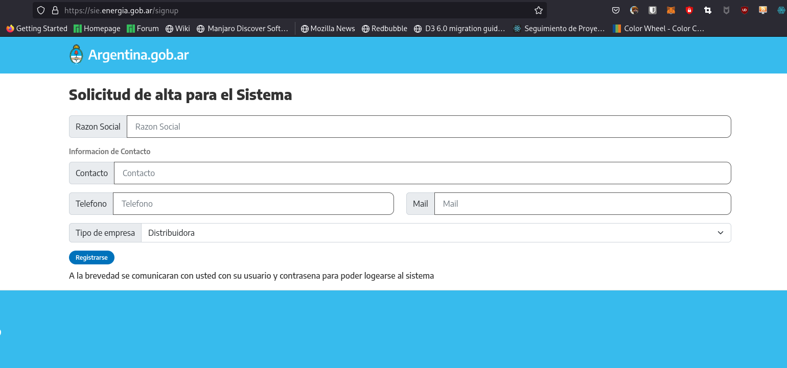
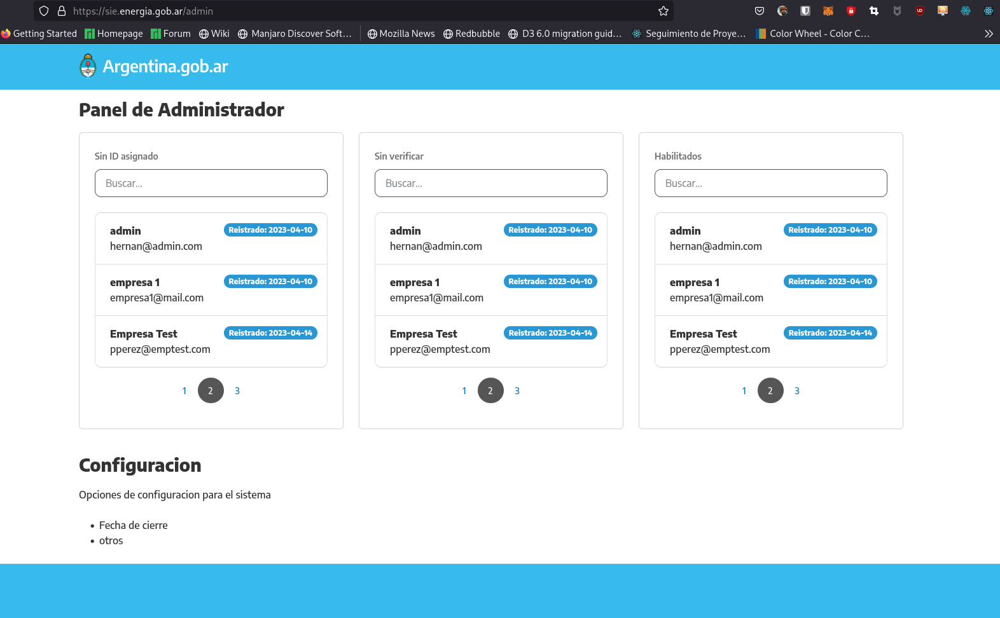
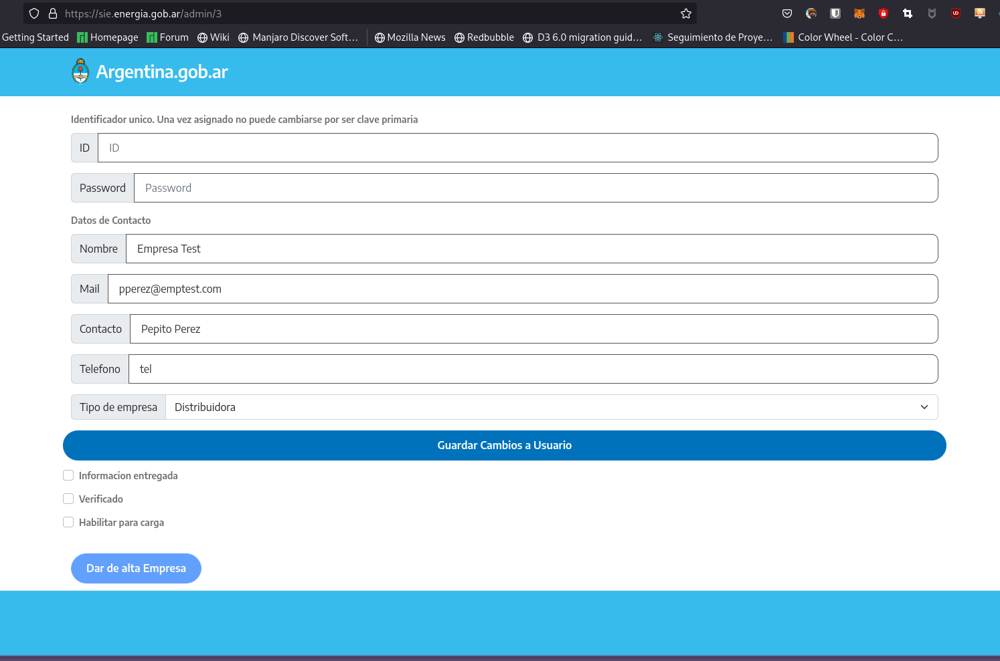
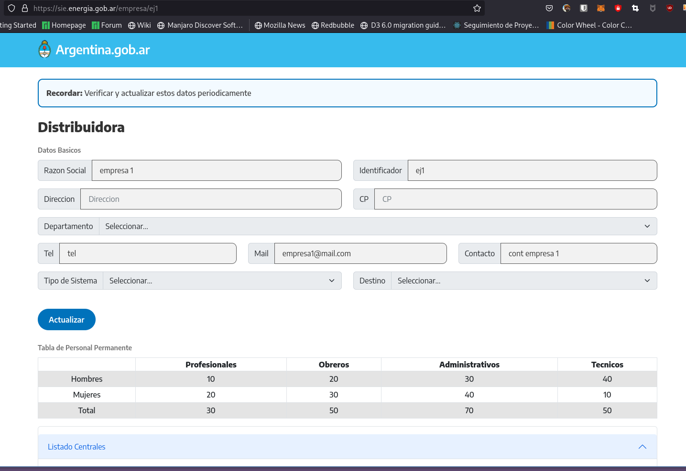

## Balance/SIE

El scope de este proyecto en un principio fue para las ~2600 empresas distribuidoras/cooperativas/autoproductoras. Un numero bastante bajo asi que la arquitectura es monolitica. Iiba a reemplazar los formularios que envia michelle nada mas. Ahora parece que se quiere ampliar a una base de datos general y bueno no va a ser tan facil.
Para entender lo que ya esta hecho tienen que saber un poco de javascript, react, react-query, prisma y tRPC.

### Deploy

El dominio https://sie.energia.gob.ar/ no esta funcionando...no se que onda. La semana pasada se veia el sistema. Y esta deployado porque se ve de aca: http://172.28.1.223:3000
El docker-compose esta en /energia/dockers/balance/
La bd esta en el server 172.28.1.224 con nombre `balance`

El stack es Nextjs con prisma como orm y uso tPRC para unir el back y el front. tRPC usa react-query internamente asi que es muy parecido.
El schema esta dentro de la carpeta `prisma`
Las "rutas" estan en la carpeta `pages`
La API esta en `/server/routers/_app.ts`, usa zod de validador.
En el `.env` hay ejemplos de las variables de entorno que usa la aplicacion, hay que crear un archivo `.env_local` con la data posta. Ese archivo esta ignorado en `.gitignore`

### El flujo para el registro es asi:

Desde `{{url}}/signup` ven esto:



Cuando se registren, no van a poder logearse porque no tienen ni usuario ni password, ni estan dados de alta. Para esto hay que logearse como admin(admin/123) e ir manualmente a `{{url}}/admin` (hay que hacer el redirect cuando se logea un admin que no es empresa)



En esta pagina ni estan decididos los boards que van a quedar, asi que faltan implementar los filtros. La idea era poder identificar rapidamente los usuarios que todavia no tienen asignado id de usuario, los que faltan entregar documentacion y los que ya estan habilitados para cargar datos.
Pero bueno, aca se ve el nuevo usuario que se creo en el punto anterior, y si se le da click, el administrador puede ver esto:



Desde aca, para que el usuario pueda logearso primero el administrador le tiene que asignar un id unico, un password. Luego guardar esta informacion. Una vez se asigna el id de usuario no se puede cambiar mas, es una PK.
Hay 3 checkboxs para ir haciendo el seguimiento de la informacion que tenga que presentar para validar su identidad y una vez se marque el de `habilitado para carga` se puede dar de alta.
El alta recien crea un nuevo usuario en la base de datos del sistema(por ahora el usuario esta solo creado en una tabla para registros) y en esta instancia el usuario se puede logear con el usuario//password que le asigno el administrador.
Todo este proceso es un galeraso porque nadie dio ningun feedback en ningun momento y no se queria usar la tabla del rase.

## Logeo de usuario

Si una empresa que ya esta registrada se logea va a ver esto:



Puede actualizar informacion basica, agregar centrales, agregar las declaraciones mensuales. Lamentablemente no esta terminado el proceso porque nunca me dijeron que pasaba si no una empresa no declaraba un mes. Tampoco se si podian declarar meses previos, asi que esta hardcodeado para que la declaracion sea del mes actual. Si pedis una declaracion nueva pero ya existe, va a ir a la pagina de la declaracion pero va a tirar un error de pk(porque ya existe una declaracion para ese mes).

## Para correr esto

First, run the development server:

```bash
npm run dev
# or
yarn dev
```

Open [http://localhost:3000](http://localhost:3000) with your browser to see the result.

You can start editing the page by modifying `pages/index.tsx`. The page auto-updates as you edit the file.

[API routes](https://nextjs.org/docs/api-routes/introduction) can be accessed on [http://localhost:3000/api/hello](http://localhost:3000/api/hello). This endpoint can be edited in `pages/api/hello.ts`.

The `pages/api` directory is mapped to `/api/*`. Files in this directory are treated as [API routes](https://nextjs.org/docs/api-routes/introduction) instead of React pages.

This project uses [`next/font`](https://nextjs.org/docs/basic-features/font-optimization) to automatically optimize and load Inter, a custom Google Font.

## Learn More

To learn more about Next.js, take a look at the following resources:

- [Next.js Documentation](https://nextjs.org/docs) - learn about Next.js features and API.
- [Learn Next.js](https://nextjs.org/learn) - an interactive Next.js tutorial.

You can check out [the Next.js GitHub repository](https://github.com/vercel/next.js/) - your feedback and contributions are welcome!

## Deploy on Vercel

The easiest way to deploy your Next.js app is to use the [Vercel Platform](https://vercel.com/new?utm_medium=default-template&filter=next.js&utm_source=create-next-app&utm_campaign=create-next-app-readme) from the creators of Next.js.

Check out our [Next.js deployment documentation](https://nextjs.org/docs/deployment) for more details.
